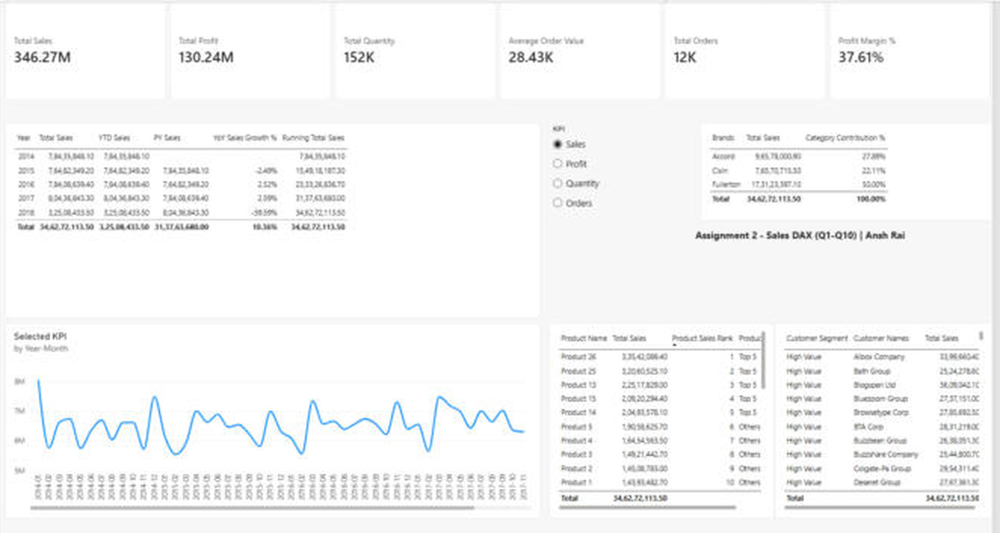

# 💼 Sales Performance Analysis in Power BI & Advanced DAX

 

A Power BI report on **18,000 sales order lines (2014–2018)** for a US distributor. It uses **time-intelligence DAX, ranking, segmentation and a slicer-driven dynamic KPI**, with the full model built as code in **TMDL**.

## 📊 Dataset
Sales orders with customers, products, US regions and state lookups (`data/sales_data.xlsx`, 5 sheets). 12,180 orders · 175 customers · 30 products · 3 brands.

## 🧱 Data model
`Sales Orders` (fact) → `Customers`, `Products`, `Regions` (→ `State Regions`, snowflake), a `Date` calendar table (marked as date table), and a disconnected `KPI Selector` table.
- **Power Query fixes:** removed **36,272 blank rows** that were inflating order counts, dropped empty columns, fixed a double header row in *State Regions*, renamed `Column1` → `County`

## 🧮 DAX (10 business questions)
| # | Question | Measure / technique |
|---|---|---|
| 1 | Core KPIs | `Total Sales = SUMX(Qty × Price)`, `Total Profit`, `Total Orders = DISTINCTCOUNT`, `Profit Margin %`, `AOV` |
| 2 | Year-to-date | `TOTALYTD([Total Sales], 'Date'[Date])` |
| 3 | Previous year | `CALCULATE(..., SAMEPERIODLASTYEAR(...))` |
| 4 | YoY growth % | `VAR` + `DIVIDE` with blank handling |
| 5 | Running total | `CALCULATE` + `FILTER(ALL('Date'), Date <= MAX(Date))` |
| 6 | Product ranking | `RANKX(ALL(Products), [Total Sales],, DESC, DENSE)` |
| 7 | Category (brand) contribution | `DIVIDE([Total Sales], CALCULATE([Total Sales], ALL(Brands)))` |
| 8 | Top 5 vs Others | Calculated column **and** dynamic measure |
| 9 | Customer value tiers | High ≥ 2.5M · Medium 1.5–2.5M · Low (column + measure) |
| 10 | Dynamic KPI switch | Disconnected table + `SWITCH(SELECTEDVALUE(...))` driving one chart |

Full code: [`dax/measures.dax`](dax/measures.dax) · model as TMDL: [`dax/model.tmdl`](dax/model.tmdl)

## 🏆 Results
| Total sales | Total profit | Margin | Orders | Avg order value |
|---|---|---|---|---|
| **$346.3M** | $130.2M | **37.6%** | 12,180 | $28,430 |

| Year | Sales | YoY |
|---|---|---|
| 2014 | $78.4M | – |
| 2015 | $76.5M | −2.5% |
| 2016 | $78.4M | +2.5% |
| 2017 | $80.4M | +2.6% |
| 2018* | $32.5M | *partial year (to 25 May)* |

## 💡 Insights
- **Fullerton brings in 50% of sales** (Accord 27.9%, Cixin 22.1%), so the business depends heavily on one brand.
- The **top 5 products (26, 25, 13, 15, 14)** drive a large share of revenue. Products 26 and 25 alone exceed $65M.
- **34 High-value customers** (19%) sit above $2.5M each; 40 are in the Low tier.
- Sales are **flat at about $76–80M a year**. Like-for-like Jan–May 2018 is −0.1% against 2017, so growth has stalled.

## ▶️ How to open
Open `Sales_Performance_DAX.pbix` in Power BI Desktop. To refresh, point the data source to `data/sales_data.xlsx`.

---
👤 **Ansh Rai**, Data Analyst · [LinkedIn](https://www.linkedin.com/in/anshrai-adr) · [GitHub](https://github.com/ANSHRAI21) · [Portfolio](https://a-s-pyratech-solutions.space)
